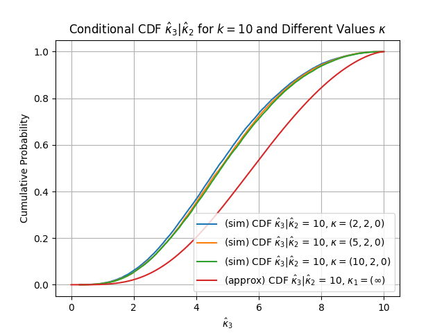

# subvector_AR_HW

A small research helper accompanying the paper: "Best Feasible Conditional Critical Values for a More Powerful Subvector Anderson-Rubin Test", to simulate the joint distribution of the smallest two eigenvalues of a noncentral real Wishart matrix $W = X^\top X$ and to plot the empirical conditional CDF of the smallest eigenvalue given the second smallest eigenvalue for different $\\kappa$ configurations, where the approximation given in GKM represents the condititional cdf when the $p-2$ largest eigenvalues are $\infty$.

This repository contains a single executable script: `simulation_plot_executable.py`.

## What it does

- Simulates joint eigenvalues $(\hat{\kappa}\_{p}, \hat{\kappa}\_{p-1})$ for a given dimension `p` and number of instruments `k`, with noncentrality specified by `mu`.
- Estimates the median of $\\hat{\kappa}_{p-1}$ from a marginal simulation to define the conditioning value.
- Computes and plots the empirical conditional CDF of $\hat{\kappa}\_{p} \mid \hat{\kappa}\_{p-1}$ for several $\kappa$ configurations.
- Overlays an analytical conditional CDF approximation via the functions `g_k1`, `conditional_density`, and `get_conditional_cdf_GKM`, which represents the condititional cdf when the $p-2$ largest $\\kappa$ values are $\\infty$.

## Requirements

- Python 3.9+ (3.10/3.11 also fine)
- Packages:
  - numpy
  - scipy
  - matplotlib

Install the dependencies in a virtual environment:

```bash
python -m venv .venv
source .venv/bin/activate  # On Windows: .venv\Scripts\activate
pip install numpy scipy matplotlib
```

## Run

From the repository root:

```bash
python simulation_plot_executable.py
```

The script is interactive; it will prompt for `p` and `n`:

```
Enter a p>2: 3
Enter the number of instruments k: 10
```
An interactive Matplotlib window will open, showing:



## Inputs and configurable knobs

- **p**: integer > 2 (matrix dimension)
- **k**: integer > p (number of instruments)
- **Simulation sizes** (inside `main()`):
  - `num_simulations_marginal = 100000` (used to estimate the conditioning value $\\hat{\kappa}_{p-1}$)
  - `num_simulations_conditional = 1000000` (used for the empirical conditional CDF)
- **Noncentrality patterns**: the script compares three settings:
  - `get_mu_list(2, 0, p)`
  - `get_mu_list(5, 0, p)`
  - `get_mu_list(10, 0, p)`

`get_mu_list(start, end, p, middle_value=2)` returns `p` points that are evenly spaced after a square-root transform and include $\\sqrt{\text{middle value}}$.

## How it works (high level)

- `simulate_joint_eigenvalues(p, n, mu, num_simulations)` constructs `X ~ N(M, I)` where `M` is diagonal with entries from `mu`, forms `W = X.T @ X`, and records the two smallest eigenvalues per simulation.
- The conditioning value $\\hat{\kappa}_{p-1}$ is the median of the simulated second-smallest eigenvalue from a marginal run.
- The “GKM” section builds an approximate conditional density via `g_k1` and `conditional_density`, and integrates it with `get_conditional_cdf_GKM` to obtain a CDF curve where the $p-2$ largest $\\kappa$ values are $\\infty$ for comparison.