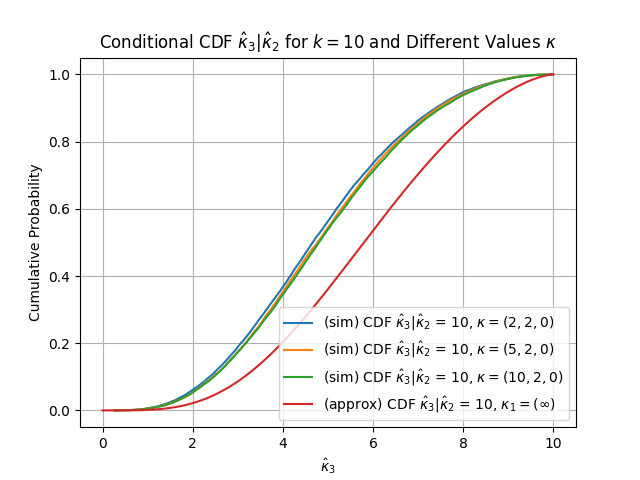

# subvector_AR_HW

A small research helper accompanying the paper: "Best Feasible Conditional Critical Values for a More Powerful Subvector Anderson-Rubin Test", to simulate the joint distribution of the smallest two eigenvalues of a noncentral real Wishart matrix $W = X^\top X$ and to plot the empirical conditional CDF of the smallest eigenvalue given the second smallest eigenvalue for different $\\kappa$ configurations, where the approximation given in GKM represents the condititional cdf when the $p-2$ largest eigenvalues are $\infty$.

The original conditional-CDF executable is `simulation_plot_executable.py`.
The repository also contains the calibrated EMW/GKM power-bound workflow in
`alfd_eigval.py` and its finite-sample comparison plot in
`new_power_comparison.py`.

## What it does

- Simulates joint eigenvalues $(\hat{\kappa}\_{p}, \hat{\kappa}\_{p-1})$ for a given dimension `p` and number of instruments `k`, with noncentrality specified by `mu`.
- Estimates the median of $\\hat{\kappa}_{p-1}$ from a marginal simulation to define the conditioning value.
- Computes and plots the empirical conditional CDF of $\hat{\kappa}\_{p} \mid \hat{\kappa}\_{p-1}$ for several $\kappa$ configurations.
- Overlays an analytical conditional CDF approximation via the functions `g_k1`, `conditional_density`, and `get_conditional_cdf_GKM`, which represents the condititional cdf when the $p-2$ largest $\\kappa$ values are $\\infty$.

## Requirements

- Python 3.9+ (3.10/3.11 also fine)
- Packages:
  - numpy
  - scipy
  - matplotlib
  - wandb (optional; only for the live power-bound dashboard)

Install the dependencies in a virtual environment:

```bash
python -m venv .venv
source .venv/bin/activate  # On Windows: .venv\Scripts\activate
pip install numpy scipy matplotlib
```

## Run

From the repository root:

```bash
python simulation_plot_executable.py
```

The script is interactive; it will prompt for `p` and `n`:

```
Enter a p>2: 3
Enter the number of instruments k: 10
```
An interactive Matplotlib window will open, showing:


## EMW power bound

The corrected p=4 bound driver uses one deterministic 68-point
strength-by-shape null grid for the whole curve. It reuses beta-invariant
stratified null banks with ordinary (not self-normalized) GKM importance
sampling, compresses the fitted mixture to at most eight active rows by
default, and then uses fresh direct iid samples for calibration, audit, and
Monte Carlo confidence limits. Matrix-hypergeometric truncation adapts for
every individual density pair.

```bash
sh koev/mhg15/build.sh
python3 alfd_eigval.py --version 352515 --profile smoke
python3 alfd_eigval.py --version 352515 --profile production \
  --preflight-only --workers 16
python3 alfd_eigval.py --version 352515 --profile production \
  --benchmark-preflight --benchmark-samples 64 --workers 16
python3 alfd_eigval.py --version 352515 --profile production \
  --workers 16 \
  --acknowledge-expensive
python3 new_power_comparison.py --version 352515 --preflight-only
python3 new_power_comparison.py --version 352515 --acknowledge-expensive
```

Corrected bound artifacts are written under `<version>/adaptive/`, and
provenance-checked finite-sample caches under `<version>/dgp/`. Legacy
`M_trunc_*` files are intentionally not loaded. Matrix-hypergeometric order is
selected separately for every density evaluation, so a curve no longer needs
to be rerun at a sequence of fixed `M_trunc` values. The production default is
11 symmetric beta points from -2 through 2, including the exact beta-zero
point. See
`docs/ALFD_power_bound_method.md` for the formulas, interpretation of the two
upper endpoints, target-machine timing benchmark, exact simulation-budget
diagnostics, and the limitation of a finite grid when `m_W=3`.

### Follow a long bound run live

The W&B integration is deliberately a separate read-only watcher. This keeps
W&B network activity and background processes out of the numerical program's
multiprocessing pools. First create or validate the finite-sample DGP cache:

```bash
python3 new_power_comparison.py \
  --version 352515 \
  --num-simulations 100000 \
  --workers 48 \
  --seed 20240101 \
  --chunk-size 5000 \
  --acknowledge-expensive
```

Then, in a second `tmux` pane or terminal, start the watcher:

```bash
python3 -m pip install wandb
wandb login
python3 watch_power_progress.py \
  --version 352515 \
  --wandb-project subvector-ar-hw \
  --wandb-mode online
```

Start the numerical driver first so its new partial checkpoint exists before
the watcher inspects any older completed artifact, especially when using
`--force` deliberately.

It validates the signed DGP cache, polls the atomically written ALFD
checkpoint, saves a local progress PNG and long-format CSV under
`352515/adaptive/`, and uploads the same overlay after every completed beta.
The figure contains only the three cached curves, labelled $\chi^2$, $c_1$,
and $c_3$, the simultaneous-confidence `bounds_confidence` EMW upper, and a
gray horizontal $\alpha$ reference line.
Additional point-estimate, grid, and implementation diagnostics remain in the
NPZ/CSV outputs but are deliberately omitted from the presentation plot.

To test only the W&B plumbing in a few seconds, without a DGP cache or any
matrix-hypergeometric work, run:

```bash
python3 watch_power_progress.py \
  --version 352515 \
  --demo \
  --wandb-project subvector-ar-hw \
  --wandb-mode online
```

The demo is visibly marked synthetic, gets a separate `emw-demo-*` run ID,
and writes only below `352515/adaptive/demo/`. It is not a power calculation.


## Inputs and configurable knobs

- **p**: integer > 2 (matrix dimension)
- **k**: integer > p (number of instruments)
- **Simulation sizes** (inside `main()`):
  - `num_simulations_marginal = 100000` (used to estimate the conditioning value $\\hat{\kappa}_{p-1}$)
  - `num_simulations_conditional = 1000000` (used for the empirical conditional CDF)
- **Noncentrality patterns**: the script compares three settings:
  - `get_mu_list(2, 0, p)`
  - `get_mu_list(5, 0, p)`
  - `get_mu_list(10, 0, p)`

`get_mu_list(start, end, p, middle_value=2)` returns `p` points that are evenly spaced after a square-root transform and include $\\sqrt{\text{middle value}}$.

## How it works (high level)

- `simulate_joint_eigenvalues(p, n, mu, num_simulations)` constructs `X ~ N(M, I)` where `M` is diagonal with entries from `mu`, forms `W = X.T @ X`, and records the two smallest eigenvalues per simulation.
- The conditioning value $\\hat{\kappa}_{p-1}$ is the median of the simulated second-smallest eigenvalue from a marginal run. 
- With these ingredients the empirical CDF of the smallest eigenvalue given the second-smallest eigenvalue can be calculated and plotted.
- The “GKM” section builds an approximate conditional density via `g_k1` and `conditional_density`, and integrates it with `get_conditional_cdf_GKM` to obtain a CDF curve where the $p-2$ largest $\\kappa$ values are $\\infty$ for comparison.
